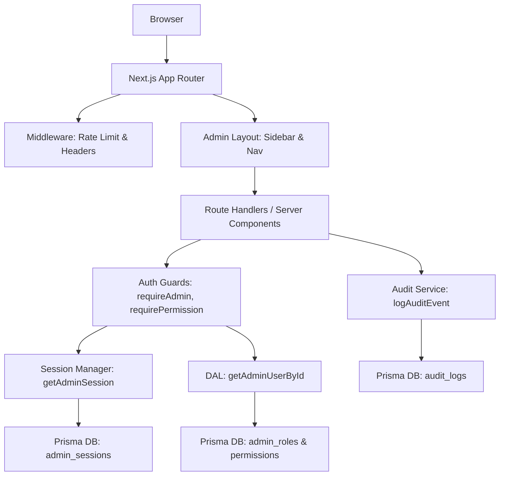

# CMS Foundation Architecture

## Overview
Phase 1 establishes a modular, secure, and extensible foundation for the Greenwave Society CMS and operations dashboard.

The key additions include:
- A database-backed Role-Based Access Control (RBAC) system.
- Centralized server-side authorization guards.
- Advanced opaque session management with strict expiration handling.
- Extensible structured audit logging.
- Modular layout for incremental CMS rollout.
- Feature flags for safely deploying in-development modules.

## Architecture

## Existing Application Inspection
Before starting, we analyzed the existing implementation. It heavily relied on:
- An email allow-list (`ADMIN_EMAILS`) via environment variables.
- A hardcoded super-admin email check.
- `AdminSession` storing `token|email` in the `token` field, rather than using a `userId` foreign key.
- A basic `AuditLog` model lacking structure (missing `outcome`, `requestId`, `beforeState`, `afterState`).

**Our strategy** does not disrupt this existing state; instead, it *adds* the new schema and securely bridges old sessions to the new RBAC model until all admins are explicitly migrated in Phase 2.

## Next Steps (Phase 2)
1. Complete the `Content` module UI.
2. Formally migrate all admins into the `AdminUser` and `AdminRole` database tables.
3. Remove the legacy email allow-list fallback logic.
